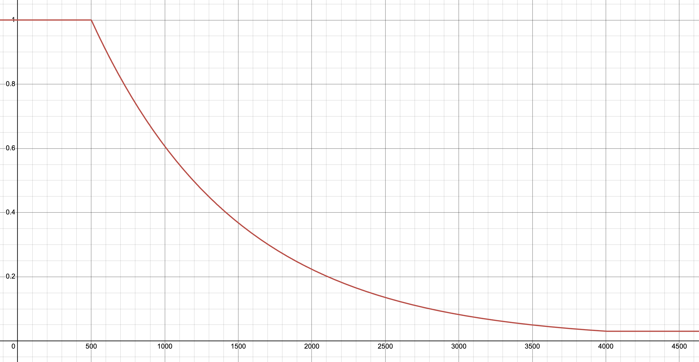

# Distributed PSGD Kron

For original PSGD repo and some great resources, see [psgd_torch](https://github.com/lixilinx/psgd_torch).

Implementation of [PSGD Kron](https://github.com/lixilinx/psgd_torch) in JAX (optax-style) for 
distributed training. PSGD is a second-order optimizer originally created by Xi-Lin Li that uses either 
a hessian-based or whitening-based (gg^T) preconditioner, lie groups, and online preconditioner updating 
to improve training convergence, generalization, and efficiency. I highly suggest taking a look at 
Xi-Lin's PSGD repo's readme linked above for interesting details on how PSGD works and experiments using PSGD. 
There are also paper resources listed near the bottom of this readme.

### `kron`:

The most versatile and easy-to-use PSGD optimizer is `kron`, which uses a Kronecker-factored 
preconditioner. It has less hyperparameters that need tuning than adam, and can generally act as a 
drop-in replacement.

## Installation

```bash
pip install distributed-kron
```

## Basic Usage (Kron)

Kron schedules the preconditioner update probability by default to start at 1.0 and anneal to 0.03 
at the beginning of training, so training will be slightly slower at the start but will speed up 
by around 4k steps.

For basic usage, use `distributed_kron.kron` optimizer like any other optax optimizer:

```python
from distributed_kron.kron import kron

optimizer = kron()
opt_state = optimizer.init(params)

updates, opt_state = optimizer.update(grads, opt_state)
params = optax.apply_updates(params, updates)
```

**Basic hyperparameters:**

TLDR: Start at learning rate around 3x smaller than adam's. There is no b2 or epsilon.

These next 3 settings control whether a dimension's preconditioner is diagonal or triangular. 
For example, for a layer with shape (256, 128), triagular preconditioners would be shapes (256, 256)
and (128, 128), and diagonal preconditioners would be shapes (256,) and (128,). Depending on how 
these settings are chosen, `kron` can balance between memory/speed and effectiveness. Defaults lead
to most precoditioners being triangular except for 1-dimensional layers and very large dimensions.

`max_size_triangular`: Any dimension with size above this value will have a diagonal preconditioner.

`min_ndim_triangular`: Any tensor with less than this number of dims will have all diagonal 
preconditioners. Default is 2, so single-dim layers like bias and scale will use diagonal
preconditioners.

`memory_save_mode`: Can be None, 'one_diag', or 'all_diag'. None is default and lets all 
preconditioners be triangular. 'one_diag' sets the largest or last dim per layer as diagonal 
using `np.argsort(shape)[::-1][0]`. 'all_diag' sets all preconditioners to be diagonal.

`preconditioner_update_probability`: Preconditioner update probability uses a schedule by default 
that works well for most cases. It anneals from 1 to 0.03 at the beginning of training, so training 
will be slightly slower at the start but will speed up by around 4k steps. PSGD generally benefits
from more preconditioner updates at the start of training, but once the preconditioner is learned 
it's okay to do them less often. An easy way to adjust update frequency is to define your own schedule
using the `precond_update_prob_schedule` function in kron.py (just changing the `min_prob` value 
is easiest) and pass this into kron through the `preconditioner_update_probability` hyperparameter.

This is roughly the default schedule defined in the `precond_update_prob_schedule` function at the top of kron.py:




**Sharding:**

Kron contains einsums, and in general the first axis of the preconditioner matrices is the 
contracting axis.

If using only FSDP, I usually shard the last axis of each preconditioner matrix and call it good.

However, if using tensor parallelism in addition to FSDP, you may think more carefully about how 
the preconditioners are sharded in train_state. For example, with grads of shape (256, 128) and kron 
preconditioners of shapes (256, 256) and (128, 128), if the grads are sharded as (fsdp, tensor), 
then you may want to shard the (256, 256) preconditioner as (fsdp, tensor) and the (128, 128) 
preconditioner as (tensor, fsdp) so the grads and its preconditioners have similar contracting axes.


**Scanned layers:**

If you are scanning layers in your network, you can also have kron scan over these layers while 
updating and applying the preconditioner. Simply pass in a pytree through `scanned_layers` with 
the same structure as your params with bool values indicating which layers are scanned. PSGD will 
vmap over the first dims of those layers. If you need a more advanced scanning setup, please open 
an issue.

For very large models, the preconditioner update may use too much memory all at once when scanning, 
in which case you can set `lax_map_scanned_layers` to `True` and set `lax_map_batch_size` to a 
reasonable batch size for your setup (`lax.map` scans over batches of vmap, see JAX docs). If 
your net is 32 layers and you're hitting OOM during the optimizer step, you can break the model into
2 or 4 and set `lax_map_batch_size` to 16 or 8 respectively.


## Resources

PSGD papers and resources listed from Xi-Lin's repo

1) Xi-Lin Li. Preconditioned stochastic gradient descent, [arXiv:1512.04202](https://arxiv.org/abs/1512.04202), 2015. (General ideas of PSGD, preconditioner fitting losses and Kronecker product preconditioners.)
2) Xi-Lin Li. Preconditioner on matrix Lie group for SGD, [arXiv:1809.10232](https://arxiv.org/abs/1809.10232), 2018. (Focus on preconditioners with the affine Lie group.)
3) Xi-Lin Li. Black box Lie group preconditioners for SGD, [arXiv:2211.04422](https://arxiv.org/abs/2211.04422), 2022. (Mainly about the LRA preconditioner. See [these supplementary materials](https://drive.google.com/file/d/1CTNx1q67_py87jn-0OI-vSLcsM1K7VsM/view) for detailed math derivations.)
4) Xi-Lin Li. Stochastic Hessian fittings on Lie groups, [arXiv:2402.11858](https://arxiv.org/abs/2402.11858), 2024. (Some theoretical works on the efficiency of PSGD. The Hessian fitting problem is shown to be strongly convex on set ${\rm GL}(n, \mathbb{R})/R_{\rm polar}$.)
5) Omead Pooladzandi, Xi-Lin Li. Curvature-informed SGD via general purpose Lie-group preconditioners, [arXiv:2402.04553](https://arxiv.org/abs/2402.04553), 2024. (Plenty of benchmark results and analyses for PSGD vs. other optimizers.)


## License

[![CC BY 4.0][cc-by-image]][cc-by]

This work is licensed under a [Creative Commons Attribution 4.0 International License][cc-by].

2024 Evan Walters, Omead Pooladzandi, Xi-Lin Li


[cc-by]: http://creativecommons.org/licenses/by/4.0/
[cc-by-image]: https://licensebuttons.net/l/by/4.0/88x31.png
[cc-by-shield]: https://img.shields.io/badge/License-CC%20BY%204.0-lightgrey.svg
